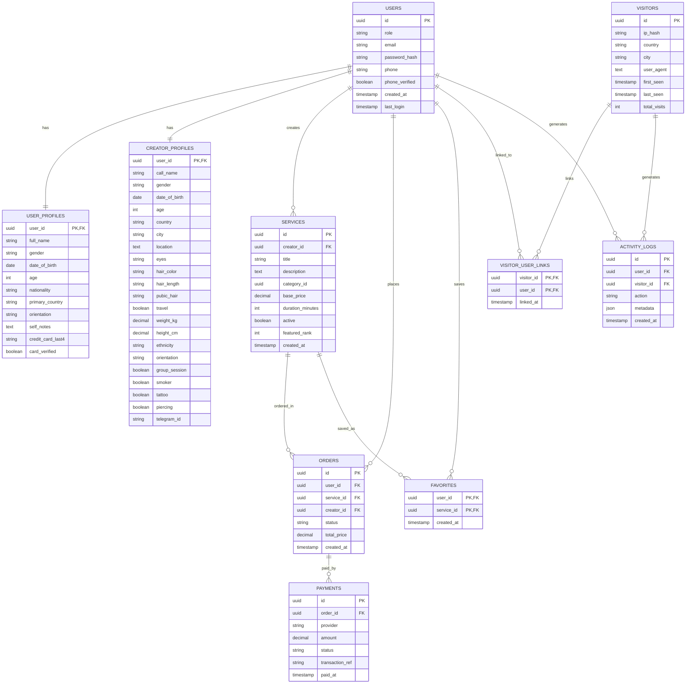
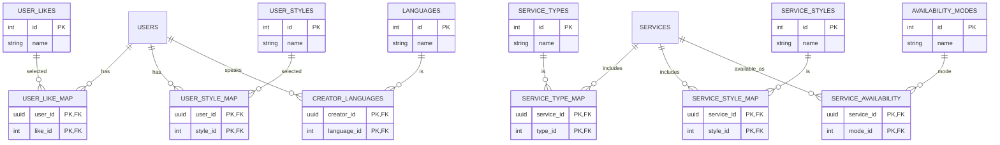

# AscortBali

AscortBali is a **lightweight service marketplace platform** inspired by premium agency-style presentation and Fiverr-like transactional flow.  
It connects **Registered Users** with **Creator Users**, supports browsing, filtering, purchasing services, and collects anonymized visitor analytics for growth and security.

This document is the **single source of truth** for architecture, stack, data model, development plan, estimates, and risks—so the team can align and start building.

---

## 1) Product Goals

- High-visual, premium homepage (agency-style reference)
- Service marketplace with pagination (**50 cards/page**)
- Separate **Registered User** and **Creator User** roles
- Secure authentication (JWT)
- Scalable cloud deployment on **GCP**
- Privacy-aware visitor analytics (**IP hashed**, never raw)
- Clean database model suitable for long-term growth

---

## 2) High-Level Features

### Public / Homepage
- Category browsing
- Search bar
- Featured services
- Creator discovery grid
- SEO-friendly pages

### Registered User (Compulsory)
- Auth (email/password; OAuth optional later)
- Profile management with strict validation (age >= 18)
- Browse/search services, favorite services
- Purchase services
- Payment verification data (format validation + verification flags)
- Activity history / purchased services

### Creator User
- Creator profile with detailed attributes
- Service creation & management
- Availability modes, service types, styles
- Creator languages
- Order management (later expansions)
- Featured placement capability

### Analytics / Security
- Visitor tracking (hashed IP) + coarse location
- Link visitor to user after login/registration
- Activity logs with metadata (JSON)

---

## 3) Tech Stack

### Frontend
- **Vue 3**
- **Next.js** (SSR/SEO-capable, integrated with Vue build approach as defined by the team)
- **Vite**
- **Tailwind CSS**
- TypeScript

> Note: “Vue + Next.js” is treated as the agreed plan for this project, with SSR used where needed for SEO and fast initial loads.

### Backend
- Node.js (REST API initially)
- JWT authentication (access + refresh)
- Stateless services

### Database
- **PostgreSQL** on **Cloud SQL (GCP)**
- Relational, normalized schema
- JSONB reserved for logs/metadata

### Infrastructure (GCP)
- Compute Engine (VM-based)
- Google Cloud Load Balancer
- Google CDN
- NGINX (reverse proxy)
- VPC + Firewall rules
- Cloud SQL (Postgres)
- Secret Manager (JWT secrets, hashing keys)

---

## 4) System Architecture (High Level)

```text
User Browser
   |
   |  HTTPS
   v
Google Load Balancer + CDN
   |
   v
NGINX (Compute Engine)
   |
   +--> Frontend (Vue / Next.js)
   |
   +--> Backend API (Node.js)
              |
              v
        Cloud SQL (PostgreSQL)
```

### Key Principles
- Horizontal scalability
- No state stored on app instances
- DB access via private IP
- CDN handles static/media delivery
- JWT for stateless auth
- Explicit audit trail for purchases and key actions

---

## 5) Authentication & Security

### Authentication
- JWT (`sub = users.id`)
- Access token (short-lived)
- Refresh token (rotated, revocable)
- Passwords hashed (bcrypt/argon2)
- Role-based authorization (User vs Creator vs Admin)

### Security Controls
- Cloud SQL private networking
- IP addresses **never stored raw**
- IP stored as **HMAC(ip, secret)** (not plain hash)
- Secrets stored in **GCP Secret Manager**
- Strict DB constraints (age >= 18, required fields)
- Audit-grade logging for purchases and key actions
- Rate limiting (especially auth + analytics endpoints)

---

## 6) Visitor Analytics (Privacy-Aware)

### What is collected
- Hashed IP address (`ip_hash`)
- Country/city (coarse)
- User agent
- Visit count & timestamps

### Linking
- Visitors can be linked to registered users **after login**
- Enables growth analytics + security/fraud signals without storing raw IPs

### Implementation Notes
- Use **HMAC-SHA256** with a server-side secret key.
- Store the hashing key in **Secret Manager** and version it.
- Consider retention policies (e.g., aggregate + purge raw visitor rows after N days if not needed).

---

## 7) Database Schema Overview (Logical)

### Entities
- `users` – auth + role
- `user_profiles` – registered user profile
- `creator_profiles` – creator profile
- `services` – offerings
- `orders` – purchases
- `payments` – payment records
- `favorites` – saved services
- `visitors` – anonymized visitor tracking
- `visitor_user_links` – link visitor to user
- `activity_logs` – actions + metadata
- Lookup & join tables for multi-select fields:
  - likes, styles, service types, availability modes, languages

### Design Principles
- Strong normalization (avoid comma-separated lists)
- Multi-selects handled via join tables
- Enums used for constrained fields
- Indexes for browsing, filtering, analytics
- Age >= 18 enforced at DB and app level

---

## 8) ER Diagram (Core)

> GitHub renders Mermaid diagrams directly in Markdown.



---

## 9) ER Diagram (Multi-Select / Lookup Tables)



---

## 10) Repository Layout (Monorepo)

```
AscortBali/
├─ apps/
│  ├─ web/                  # Vue + Next.js frontend
│  └─ api/                  # Backend API
├─ packages/
│  ├─ ui/                   # Shared UI components (Tailwind configs, tokens)
│  ├─ types/                # Shared TypeScript types
│  └─ config/               # ESLint/TSConfig/Prettier shared configs
├─ docs/
│  ├─ product/              # Feature specs & user flows
│  ├─ architecture/         # Diagrams + ADRs (decision records)
│  ├─ database/             # Schema notes + migrations + seed strategy
│  └─ infra/                # GCP deployment + firewall + nginx config notes
├─ scripts/
├─ .env.example
└─ README.md
```

---

## 11) API Surface (Initial)

### Auth
- `POST /auth/register` (role: user/creator)
- `POST /auth/login`
- `POST /auth/refresh`
- `POST /auth/logout`

### Browse/Search
- `GET /categories`
- `GET /services?category=&q=&page=&pageSize=50&sort=...`
- `GET /services/:id`

### User
- `GET /me`
- `PUT /me/profile`
- `GET /me/favorites`
- `POST /me/favorites/:serviceId`
- `DELETE /me/favorites/:serviceId`
- `GET /me/orders`

### Creator
- `GET /creator/me`
- `PUT /creator/me/profile`
- `POST /creator/me/services`
- `PUT /creator/me/services/:id`
- `GET /creator/:id` (public profile)

### Orders & Payments
- `POST /orders` (create order)
- `POST /payments` (confirm payment via provider callback/webhook)

### Analytics
- `POST /analytics/visit` (visitor heartbeat or page view)
- `POST /analytics/link` (link visitor_id to user_id after auth)

---

## 12) Performance Requirements

- Services listing: **50 cards per page**
- Indexed queries for:
  - category browsing
  - featured services
  - creator services
  - orders by user/creator
- CDN for static/media delivery
- Avoid N+1 queries (use joins and careful query planning)

---

## 13) Development Plan & Task Breakdown (Phases)

### Phase 1 — Foundation (Project Skeleton + Auth + Base UI)

**Frontend**
- Initialize app skeleton (routing/layouts/Tailwind/component structure)
- Build Auth screens: register/login (User + Creator)
- Form validation rules: email/phone/DOB (18+), required fields
- Basic Homepage shell (hero + featured placeholders)
- Error/empty/loading states baseline

**Backend**
- API skeleton: routing, error handling, logging, validation layer
- JWT auth: access/refresh, rotation, logout (revocation strategy)
- RBAC middleware (user vs creator vs admin)
- Basic rate limiting: login/register endpoints

**Database**
- Cloud SQL connection approach (private IP + connector/proxy)
- Migrations system + baseline schema: users, profiles, visitors, activity logs
- Seed lookups (likes/styles/service types/availability/languages)
- Constraints (unique email, required fields, age >= 18)

**Infra (Dev Baseline)**
- `.env.example` and secret placeholders
- Local dev scripts (optional) for Postgres local
- Logging format and basic health endpoint

**Deliverable**
- Working auth for user & creator
- Login sessions via JWT
- DB migrations running end-to-end

---

### Phase 2 — Marketplace Core (Browse/Search/Service/Order)

**Frontend**
- Service listing page with pagination (50/page)
- Category browsing UI
- Search + filters (category, price range, sort)
- Service detail page
- Favorites UI (save/unsave)
- Order creation + payment “recording” UI (initial stub)

**Backend**
- Services endpoints: browse/search/filter/sort/paginate
- Favorites endpoints
- Order creation endpoint (transactional)
- Payments record endpoint (stub or real provider integration)
- Read models optimized for listing queries

**Database**
- Services + mappings (types/styles/availability)
- Orders + payments + favorites
- Indexes for listing and filtering
- Activity log events for browsing and purchasing

**Deliverable**
- Browse → select service → create order → record payment (stub OK)
- Favorites + user order history

---

### Phase 3 — Creator Operations + Analytics Linkage

**Frontend**
- Creator profile editor (all creator fields + validation)
- Creator service CRUD UI (create/edit/activate/deactivate)
- Creator public profile page (services + key attributes)
- Featured services display hook (admin/manual toggle later)

**Backend**
- Creator profile endpoints
- Creator services CRUD endpoints
- Analytics endpoints: visitor upsert + link to user after login
- Activity log coverage for key events (login, view service, order, etc.)

**Database**
- Creator auxiliary tables (languages, service mappings)
- Visitor_user_links + indexes
- Additional constraints around creator-only fields

**Deliverable**
- Creator can publish services
- Visits tracked (hashed IP) and linked post-auth
- Creator pages stable and performant

---

### Phase 4 — Hardening & Production Readiness (GCP + Ops)

**Infra**
- GCE deployment baseline (systemd/pm2, or container strategy)
- NGINX reverse proxy config: TLS termination strategy, routing, gzip/brotli, caching headers
- Load Balancer + CDN configuration notes
- Firewall rules: allow LB health checks, restrict admin surfaces
- Cloud SQL private IP, backups, PITR, HA where needed
- Secret Manager integration

**Backend**
- Rate limiting expansion (analytics endpoints, order/payment)
- Stronger validation + sanitization
- Payment webhook hardening (idempotency, signature verification) if enabled
- Audit-grade logs and admin-safe diagnostics

**Observability**
- Structured logs
- Basic metrics dashboards
- Error monitoring hooks

**Deliverable**
- Production deployment baseline on GCP
- Stable performance and security baseline

---

## 14) Definition of Done (DoD) per Phase

### DoD — Phase 1
- Auth works for both roles; refresh token flow works
- Basic homepage renders without errors
- DB schema migrated successfully in dev + staging
- All required fields validated (server-side) with clear error messages
- Lint + typecheck pass; minimal smoke tests exist

### DoD — Phase 2
- Services list supports pagination = 50/page and filters without timeouts
- Service detail loads reliably
- Favorites persist correctly and are consistent
- Orders created transactionally; payment record created; status transitions correct
- Listing endpoints are indexed and benchmarked (basic)

### DoD — Phase 3
- Creator CRUD complete: profile and services
- Analytics tracking works with hashed IP; linking is correct after auth
- Activity logs record key actions with stable schema
- Public creator pages stable; no PII leakage in logs

### DoD — Phase 4
- Deployable to GCP with documented steps
- Cloud SQL secured (private IP, backups, PITR)
- Firewall rules documented; only needed ports open
- Rate limiting and input sanitization applied
- Monitoring/logging basics in place; on-call runbook stub exists

---

## 15) Estimated Development Hours (One Developer)

Estimates assume:
- 1 Developer doing full-stack + basic infra documentation
- No dedicated UI/UX designer (Tailwind-based UI)
- Payment integration initially stubbed (can be made real in Phase 4)
- Reasonable test coverage (smoke tests + critical path)

### Phase 1 — Foundation
- Repo + tooling + CI baseline: **12–18h**
- Frontend skeleton + auth UI + validation: **25–40h**
- Backend auth (JWT access/refresh) + RBAC: **30–45h**
- DB schema + migrations + lookup seeds: **16–24h**
- **Total Phase 1:** **83–127h**

### Phase 2 — Marketplace Core
- Service listing/search/filter + pagination (50/page): **30–45h**
- Service detail + favorites UI: **18–28h**
- Backend browse/search endpoints + indexes: **24–36h**
- Orders + payments (stub/recording): **24–40h**
- **Total Phase 2:** **96–149h**

### Phase 3 — Creator + Analytics
- Creator profile editor + validation: **28–45h**
- Creator service CRUD UI: **24–40h**
- Backend creator endpoints: **20–32h**
- Visitor analytics (hashing, linking, logging): **20–35h**
- **Total Phase 3:** **92–152h**

### Phase 4 — Production Hardening
- GCP deployment baseline (GCE, NGINX, LB/CDN, firewall, secrets): **30–55h**
- Performance tuning + caching + rate limiting: **18–35h**
- Observability baseline (logs, dashboards, alerts minimal): **12–25h**
- **Total Phase 4:** **60–115h**

#### Total Build Estimate (Phases 1–4)
**331–543 hours** for one Developer.

---

## 16) Data Work: Scrape / Massage / Mine Existing 200 Creators

This is separate due to dependency on source format and data quality.

### Tasks
- Source inventory + scraping approach design: **8–16h**
- Build scraper/importer + retries + rate limit handling: **20–45h**
- Data cleaning & normalization (names, locations, enums, DOB/age checks): **25–60h**
- Matching & deduplication rules: **12–30h**
- Manual review + exception handling: **20–50h**
- Loading into DB + validation reports: **12–24h**

#### Estimated Total for 200 Creators
**97–225 hours**

> If images must be downloaded, resized, de-duplicated, and uploaded to CDN/storage workflow, add **+20–60h**.

---

## 17) Risks & Mitigations (Risk Register)

### R1 — Privacy/Compliance Risk (IP + Sensitive Profile Attributes)
- **Risk:** Storing/processing identifiers + sensitive profile content may trigger legal/compliance requirements.
- **Mitigation:** Store **HMAC-hashed IP only**; minimize retention; separate analytics tables; document lawful basis; implement access controls; redact logs.

### R2 — Security Risk (Auth Abuse / Credential Stuffing)
- **Risk:** Marketplace sites attract bot traffic and brute force attempts.
- **Mitigation:** Rate limiting; lockouts; CAPTCHA on registration/login (optional); strong password policy; audit logging.

### R3 — Payment Risk (Chargebacks / Fraud / Webhook Replay)
- **Risk:** Fraud/chargeback exposure.
- **Mitigation:** Idempotent webhooks; signature verification; store provider transaction refs; fraud heuristics (visitor linkage signals).

### R4 — Data Quality Risk (200 Creator Import)
- **Risk:** Imported data may be inconsistent, incomplete, duplicated, or outdated.
- **Mitigation:** Build validation reports; define strict mappings; manual review queue; “draft” creator status until verified.

### R5 — Performance Risk (Listing + Filters at Scale)
- **Risk:** Service browse/search becomes slow as dataset grows.
- **Mitigation:** Indexes; cursor pagination where appropriate; caching; precomputed featured lists; avoid N+1.

### R6 — Operational Risk (VM-based Deployment Complexity)
- **Risk:** Manual VM ops, patching, and process management increases downtime risk.
- **Mitigation:** Document standard deployment; use systemd/pm2; automate with CI; enable HA where required; backups + PITR.

---

## 18) Milestones (Gantt-Style in Markdown)

Assuming sequential execution by one Developer, a practical cadence is:

1. **M1 — Repo + Auth + DB Baseline (Phase 1)**  
   Output: working login/registration for user & creator, base schema, deployable dev environment.

2. **M2 — Marketplace Browse + Order Stub (Phase 2)**  
   Output: browse/search/paginate 50/page, service detail, favorites, create order + record payment stub.

3. **M3 — Creator CRUD + Analytics Linkage (Phase 3)**  
   Output: creator profile/service management, visitor tracking + linking, activity logs.

4. **M4 — Production Baseline on GCP (Phase 4)**  
   Output: load balancer + CDN, NGINX routing, Cloud SQL secured, monitoring/rate limiting baseline.

5. **M5 — Import 200 Creators (Data Work)**  
   Output: ingestion pipeline + cleaned dataset + validation reports + operational process for updates.

---

## 19) Decision Log (Initial)

- ✅ PostgreSQL over MySQL
- ✅ Cloud SQL over self-managed DB
- ✅ JWT over session cookies
- ✅ GCP Load Balancer + CDN + NGINX
- ✅ Privacy-first analytics (HMAC IP hashing)

Changes to major decisions should be recorded in:
`/docs/architecture/decisions.md`

---

## 20) Team Agreement

This README defines:
- the approved technical direction
- the initial product scope
- baseline architecture and schema direction
- the implementation roadmap and time expectations

---

## 21) Project Name

**AscortBali**
